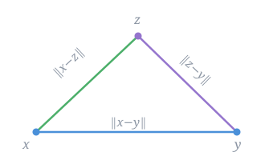

# Every styled element, on one page

A reference note that exercises each rule in the four content snippets, so you
can see what a change does without hunting for a real note that happens to use
the feature. `cssclasses: [numbered]` is set in the frontmatter above, which is
why every `##` below carries an `01` / `02` eyebrow — delete that line to see
the unnumbered default.

Inline styling: **bold**, _italic_, `inline code`, ~~strikethrough~~, a
[external link](https://obsidian.md), an internal link to [[01-Notes]], and
inline math $\|x - y\| \le \|x - z\| + \|z - y\|$ sitting in a line of prose.

> [!imp] Two things this page cannot show you
> `transparent-ui.css` styles the window chrome — titlebar, ribbon, sidebars,
> status bar — so it is visible *around* this note, never inside it.
>
> Also: `readableLineLength` is `false` in `app.json`, so linalg.css's
> `--file-line-width: 780px` is currently inert — core only applies it under
> `.is-readable-line-width`. Notes span the full pane width instead. Turn on
> Settings → Editor → Readable line length to put the measure back in play.

---

## Headings

The rule above is an `hr`, restyled as a five-stop gradient in the palette
colors. `h1` uses a fluid `clamp()` scale with balanced wrapping; `h2` gets a
hairline separator and generous lead; `h4`–`h6` become sans-serif uppercase
eyebrows rather than progressively smaller headings.

### An h3, for a subsection

#### h4 renders as an eyebrow

##### so does h5

###### and h6

## Mathematics

Inline math flows with the serif body text: the norm $\|v\|$, a scalar
$\lambda \in \mathbb{R}$, a quotient $\tfrac{a}{b}$, and a spectrum
$\operatorname{spec}(A) = \{\lambda_1, \dots, \lambda_n\}$.

Display math is centered, with the surrounding rhythm set by the snippet
rather than by MathJax's own margins:

$$
d(x, y) \;=\; \|x - y\| \qquad\text{for all } x, y \in V.
$$

A deliberately wide equation — narrow the pane and this one scrolls inside its
own box instead of spilling past the note edge. Hover it to reveal the thin
scrollbar, and check that you can reach **both** ends:

$$
\det(A - \lambda I) \;=\; \lambda^{6} - c_{5}\lambda^{5} + c_{4}\lambda^{4} - c_{3}\lambda^{3} + c_{2}\lambda^{2} - c_{1}\lambda + c_{0} \;=\; \prod_{i=1}^{6} (\lambda - \lambda_{i}) \qquad\text{where } \lambda_{i} \in \operatorname{spec}(A)
$$

A tagged equation keeps its number pinned to the right margin:

$$
\|a + b\|^{2} + \|a - b\|^{2} = 2\|a\|^{2} + 2\|b\|^{2} \tag{1}
$$

Display math nested in a list item takes tighter margins:

- The insert-and-subtract step is an identity, not an assumption:
  $$x - y = (x - z) + (z - y)$$
- Applying the norm's triangle inequality to that sum gives the result.

## Callout environments

> [!thm] Theorem (norm induces a metric)
> Let $(V, \|\cdot\|)$ be a normed vector space. Then $d(x,y) = \|x - y\|$
> defines a metric on $V$.

> [!prop] Proposition
> Non-negativity is redundant: it follows from the remaining three axioms.

> [!lem] Lemma
> For any $v \in V$, $\|-v\| = \|v\|$.

> [!cor] Corollary
> Every normed space is a topological space under the metric topology.

> [!def] Definition (metric space)
> A set $V$ with a function $d : V \times V \to \mathbb{R}$ satisfying
> non-negativity, identity of indiscernibles, symmetry, and the triangle
> inequality.

> [!hum] Intuition
> A norm measures the size of one vector; a metric measures the distance
> between two points. In a vector space you can convert one into the other,
> because the displacement from $y$ to $x$ is just the vector $x - y$.

> [!case] Case 1
> Suppose $\lambda = -1$. Then homogeneity gives symmetry directly.

> [!?] Open question
> Which metrics on a vector space arise from a norm?

> [!key] Key takeaway
> Translation invariance plus absolute homogeneity is exactly the condition
> for a metric to come from a norm.

> [!imp] Careful
> The converse fails. The discrete metric is a metric that no norm induces.

> [!def]- A collapsed callout
> Callouts ending in `-` start folded; `+` starts them open but foldable.
> Both keep their type color.

### Proofs and the QED marker

A proof ending in a paragraph gets the marker appended to the final line, the
way `amsthm` places it:

> [!pf] Proof
> Substituting $v = x - y$ into $\|v\| \ge 0$ gives non-negativity, and
> $\|v\| = 0 \iff v = \vec{0}$ gives identity of indiscernibles. Symmetry
> follows from homogeneity at $\lambda = -1$.

A proof ending in a display equation gets it on its own line, flush right,
because there is no line of text for it to sit on:

> [!pf] Proof (triangle inequality)
> Write $x - y = (x - z) + (z - y)$ and set $a = x - z$, $b = z - y$:
> $$\|x - y\| = \|a + b\| \le \|a\| + \|b\| = \|x - z\| + \|z - y\|.$$

A nested callout inside a proof must **not** pick up a stray marker of its own
— only the outer proof gets one:

> [!pf] Proof by cases
> Split on whether $x = y$.
>
> > [!case] Case 1: $x = y$
> > Then $\|x - y\| = \|\vec{0}\| = 0$, and there is nothing to check.
>
> Case 2 is the generic one, and closes the argument.

## Tables

The first column wraps rather than being forced onto one line, which is what
keeps a table of math statements inside the measure:

| Norm axiom | gives | Metric axiom |
| --- | --- | --- |
| $\|v\| \ge 0$ | → | non-negativity |
| $\|v\| = 0 \iff v = \vec{0}$ | → | identity of indiscernibles |
| $\|\lambda v\| = \|\lambda\|\,\|v\|$ (at $\lambda = -1$) | → | symmetry |
| $\|a + b\| \le \|a\| + \|b\|$ | → | triangle inequality |

Headers are uppercase and tracked out; rows are separated by hairlines rather
than boxed, and highlight on hover. Code in a cell drops its chip background:

| Routine | Cost | Returns |
| --- | --- | --- |
| `numpy.linalg.norm` | $O(n)$ | scalar |
| `scipy.linalg.lu` | $O(n^3)$ | `(P, L, U)` |

## Lists

- Bullets are squares rotated into diamonds, tinted with the accent color
- A second item, long enough to wrap so you can see how the marker aligns
  against a hanging indent that runs onto a second line
    - A nested item
        - And a third level

1. Ordered lists keep their numerals
2. Second
3. Third

- [ ] Task lists use a different element, so they are left to the theme
- [x] A completed task

## Code

Inline `code` gets a lighter chip background than a fenced block. Fenced
blocks are bordered and rounded, with the palette mapped onto the syntax
tokens:

```python
import numpy as np

def induced_metric(x, y, ord=2):
    """Distance from the norm: d(x, y) = ||x - y||."""
    return np.linalg.norm(np.asarray(x) - np.asarray(y), ord=ord)

assert induced_metric([0, 0], [3, 4]) == 5.0   # comment styling is italic
```

```js
const spectrum = matrix => eig(matrix).values.filter(v => Math.abs(v) > 1e-12);
```

## Blockquotes

A plain blockquote is styled independently of callouts — the snippet carries
`:not(.callout)` so the two never collide:

> Every norm induces a metric, but not every metric comes from a norm. The
> word "automatically" in the problem statement is doing real work.

## Images

`img.css` matches on alt text. `` centers the image and rounds its
corners:



`` floats it into the margin, and body text wraps around it:


The detour through $z$ never shortens the trip, which is the geometric reading
of the triangle inequality. This paragraph exists mainly to give the floated
figure something to sit beside, so keep it long enough to actually wrap past
the bottom edge of the image and demonstrate that the float clears correctly
rather than colliding with whatever follows it.

---

Reached the end — the rule above is the gradient `hr` again, closing the page.
